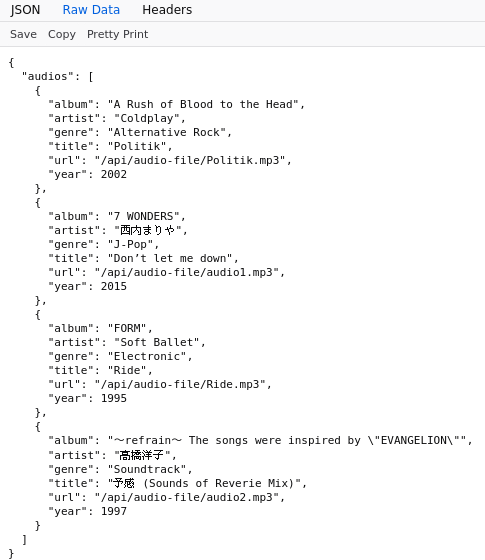

# saint-yellow/react-music-player
前端习作 #02: 结合React和Flask的在线音乐播放器\
本习作受启发于该仓库：[miguelgrinberg/react-flask-app](https://github.com/miguelgrinberg/react-flask-app)。

## 原理简述
> 本项目分为前端（React）和后端（Flask），是前后端分离的开始模式的一次初步尝试。\
> 后端托管MP3音频文件并解析MP3音频文件的元数据，以Web API的形式将音频文件及其元数据提供给前端。\
> 前端请求后端提供的Web API，以获取所有的音频文件以及每个音频文件相应的元数据。\
> \
> 元数据：指的是音频文件的各类标签，如标题、艺术家、专辑、流派、发行年份等。

## 前端
- 支持从播放列表选曲播放
- 支持perv/next切曲播放
- 默认自动播放以及列表循环播放

## 后端
- [使用Flask蓝本的方式组织代码](./backend/api/__init__.py)
- [使用eyed3库解析音频文件的元数据](./backend/api/views.py)
- 音频文件及其元数据作为Web API响应的组成部分

- [requirements](./backend/requirements.txt)

## 演示

> 本习作展示音频文件的标题、艺术家、专辑、流派以及发行年份。\
> 所以为确保正常演示，本习作要求音频文件具备上述五种信息。\
> 音频格式以MP3为佳，其他格式亦可尝试。
